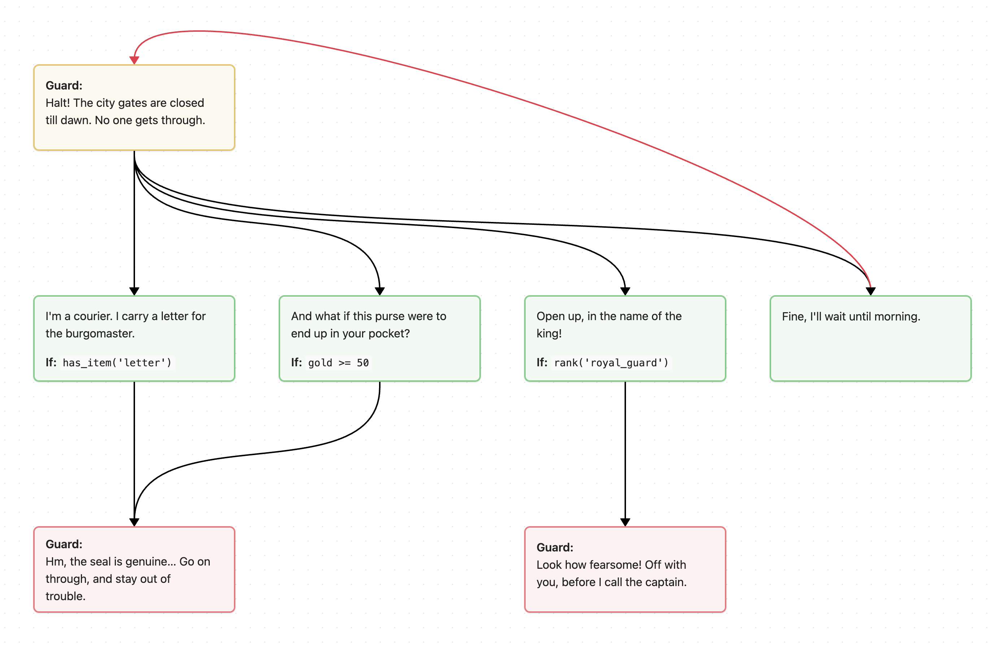

<!-- 
SPDX-FileCopyrightText: © 2026 SBT Localization https://sbt.localization.com.ua
SPDX-License-Identifier: BlueOak-1.0.0
SPDX-FileContributor: Serhii Olendarenko <sergey.olendarenko@gmail.com> 
-->

# dCanvas

**✅ Українська** | [☑️ English](README.en.md)

Формат файлів для перегляду діалогових графів з ігор.

## Що це

dCanvas (**d**ialogue **canvas**) — це надбудова над [JSON Canvas](https://jsoncanvas.org/), яка несе додаткову інформацію, потрібну для діалогів в іграх: хто говорить, що бачить гравець, за яких умов відкривається відповідь. Кожен dCanvas-файл — водночас валідний JSON Canvas, тож будь-який редактор JSON Canvas (зокрема Obsidian) відкриє, покаже і збереже його без втрат.

Формат побудований із трьох шарів:

- **Шар 0 — JSON Canvas.** Стандартні поля (`id`, `x`, `y`, `text`, …): геометрія і весь видимий текст.
- **Шар 1 — словник діалогів.** Поля з префіксом `d-` (`d-kind`, `d-character`, `d-condition`, …), визначені специфікацією dCanvas.
- **Шар 2 — проєктні розширення.** Поля з префіксом `x-`, що належать конкретній грі чи рушію. Формат їх не тлумачить, але кожен інструмент **мусить зберігати** всі невідомі поля при перезаписі.

## Приклад

Вартовий не пускає гравця до міста. Гравець має чотири відповіді: три ведуть далі (кожна за власною умовою `d-condition`), а четверта повертає розмову на початок (`d-kind: "loop"` на ребрі).

```json
{
  "d-version": "1.0",
  "nodes": [
    {
      "id": "gate", "type": "text", "d-kind": "line",
      "x": 0, "y": 0, "width": 280, "height": 120, "color": "3",
      "d-character": { "name": "Guard", "portrait": "guard.png" },
      "text": "Halt! The city gates are closed till dawn. No one gets through."
    },
    {
      "id": "letter", "type": "text", "d-kind": "reply",
      "x": 0, "y": 320, "width": 280, "height": 120, "color": "4",
      "d-condition": "has_item('letter')",
      "text": "I'm a courier. I carry a letter for the burgomaster."
    },
    {
      "id": "bribe", "type": "text", "d-kind": "reply",
      "x": 340, "y": 320, "width": 280, "height": 120, "color": "4",
      "d-condition": "gold >= 50",
      "text": "And what if this purse were to end up in your pocket?"
    },
    {
      "id": "threat", "type": "text", "d-kind": "reply",
      "x": 680, "y": 320, "width": 280, "height": 120, "color": "4",
      "d-condition": "rank('royal_guard')",
      "text": "Open up, in the name of the king!"
    },
    {
      "id": "wait", "type": "text", "d-kind": "reply",
      "x": 1020, "y": 320, "width": 280, "height": 120, "color": "4",
      "text": "Fine, I'll wait until morning."
    },
    {
      "id": "open", "type": "text", "d-kind": "line",
      "x": 0, "y": 640, "width": 280, "height": 120, "color": "1",
      "d-character": { "name": "Guard", "portrait": "guard.png" },
      "text": "Hm, the seal is genuine… Go on through, and stay out of trouble."
    },
    {
      "id": "angry", "type": "text", "d-kind": "line",
      "x": 680, "y": 640, "width": 280, "height": 120, "color": "1",
      "d-character": { "name": "Guard", "portrait": "guard.png" },
      "text": "Look how fearsome! Off with you, before I call the captain."
    }
  ],
  "edges": [
    { "id": "e1", "fromNode": "gate", "fromSide": "bottom", "toNode": "letter", "toSide": "top", "color": "#000000" },
    { "id": "e2", "fromNode": "gate", "fromSide": "bottom", "toNode": "bribe", "toSide": "top", "color": "#000000" },
    { "id": "e3", "fromNode": "gate", "fromSide": "bottom", "toNode": "threat", "toSide": "top", "color": "#000000" },
    { "id": "e4", "fromNode": "gate", "fromSide": "bottom", "toNode": "wait", "toSide": "top", "color": "#000000" },
    { "id": "e5", "fromNode": "letter", "fromSide": "bottom", "toNode": "open", "toSide": "top", "color": "#000000" },
    { "id": "e6", "fromNode": "bribe", "fromSide": "bottom", "toNode": "open", "toSide": "top", "color": "#000000" },
    { "id": "e7", "fromNode": "threat", "fromSide": "bottom", "toNode": "angry", "toSide": "top", "color": "#000000" },
    { "id": "e8", "fromNode": "wait", "fromSide": "top", "toNode": "gate", "toSide": "top", "d-kind": "loop", "color": "1" }
  ]
}
```

Так міг би виглядати цей діалог у програмі для перегляду:

## Специфікація

- [Специфікація dCanvas 1.1](spec/dCanvas-1.1.md)
- [JSON Schema](spec/dCanvas-1.1.schema.json) — крос-мовний контракт формату

Типове розширення файлів — `.d.canvas`; компактна альтернатива — `.dcanvas`.

У цьому ж репозиторії живуть еталонна Go-бібліотека `github.com/sbtlocalization/dcanvas` (читання/запис зі збереженням невідомих полів та автоматичне розкладання графа) і CLI-інструмент `dcanvas` у `cmd/dcanvas`.

## Ліцензія

[BlueOak-1.0.0](LICENSES/BlueOak-1.0.0.txt)
